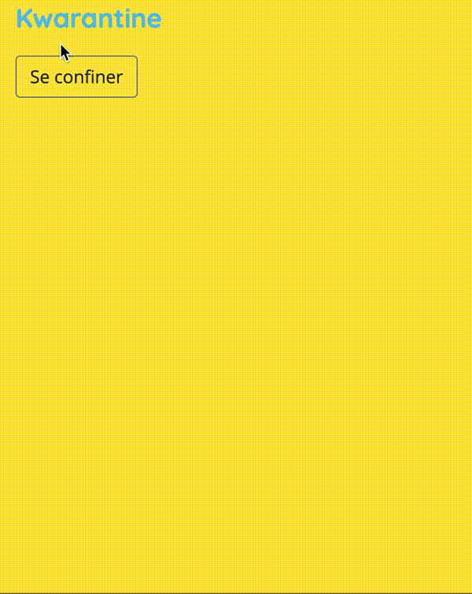

# Kwarantine

Real-time multiplayer mini games (actual game in French)



## Installation

```
cd client
npm i
cd ../server
npm i --save-dev
npm start
```

In another tab

```
cd client
npm run dev
```

## Docs

Generate docs

```
cd server
npm run build-docs
```
