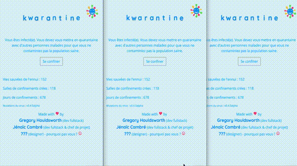

# Kwarantine

Real-time multiplayer mini games (actual game in French)



Current status

## Installation

```
cd client
npm i
cd ../server
vim .env # with variables PORT, PORT_SSL and ENV=development|test|production
npm i --save-dev
npm start
```

In another tab

```
cd client
npm run dev
```

## Docs

Generate docs

```
cd server
npm run docs
```

## Miscellaneous

- ID that generates funny avatars: l7QZktjfUBS8li98AAAA

## Changelog

### 0.4.0

- Add game (Scrambler)

### 0.3.0

- Add game (Guess the flag)
- Daily count of games

### 0.2.1

- Fix when the last scoreboard doesn't show up

### 0.2.0

- Added game (Mental arithmetic)
- Can play at 4 or alone
- Settings management
- Score uniformisation
- Adding time in score attribution

### 0.1.0

- First release
- Socket io backend 
- Ability to play at 4
- One game (longest word)